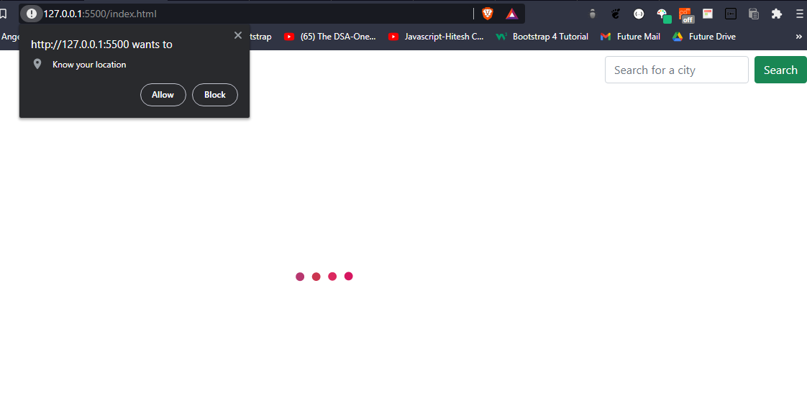

# Weather App
This is a weather app that fetches weather details of a particular location and displays it.

## Features:
- Used Fetch Api 
- Checks for the location of the device first using Geolocation API
- Handles Error if weather fetching has a problem
- Gives a loading animation while fetching the details.

## Screenshots :

